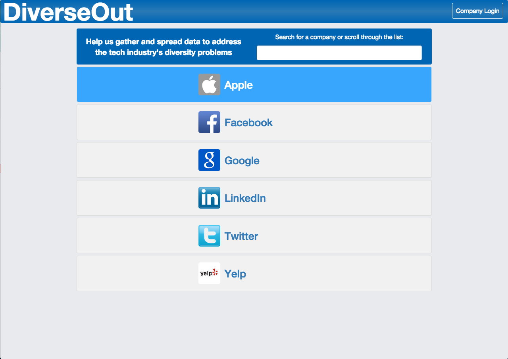
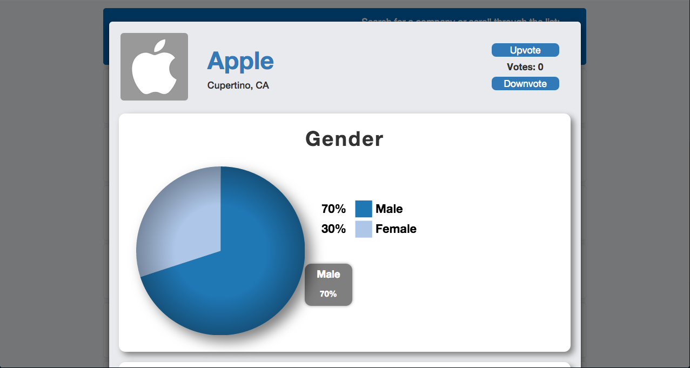
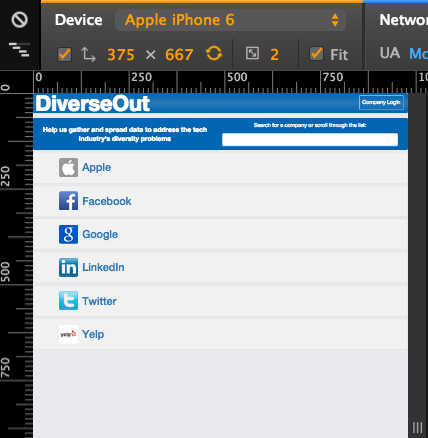
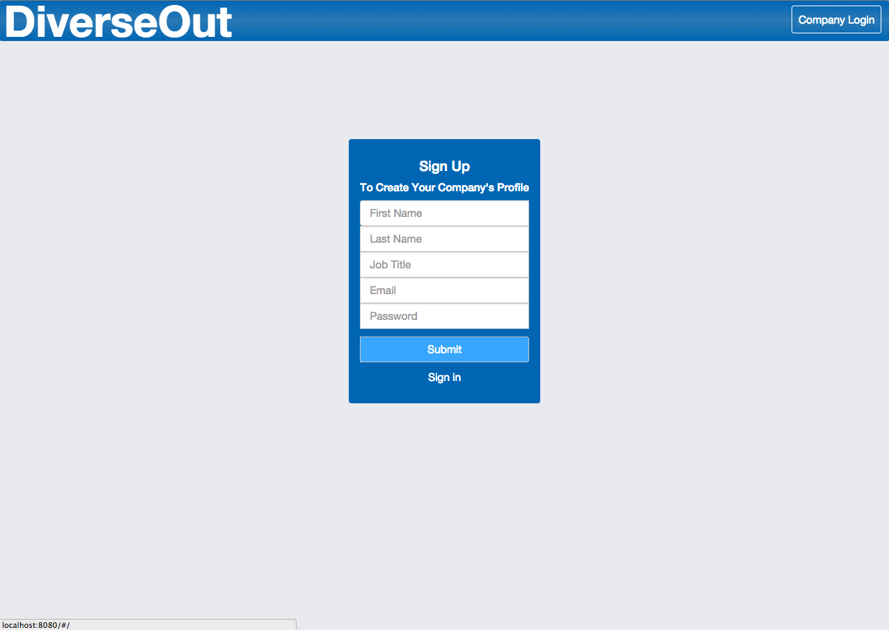

#DiverseOut
#### DiverseOut Client

** App in progress, coming very soon!  **

DiverseOut makes it easier for tech companies to gather and release their diversity data. Tech giants have finally [started to release](http://blogs.wsj.com/digits/2014/12/30/2014-the-year-silicon-valley-spilled-its-diversity-data/) their diversity numbers, but what about smaller startups that make up much of the industry? DiverseOut aggregates and displays diversity data for tech companies of all sizes. Company representatives can create private surveys for their employees, with varying levels of data abstraction to ensure employee privacy.

Read [more thoughts](http://philril.github.io/blog/c4-tech-issues.html) on why diversity in tech is vitally important... Because the tech industry's most pressing problems aren't technical.

##### Local setup instructions:
- Download and install the [Nodemon](https://github.com/remy/nodemon) npm package.
- Use nodemon to open the 'server.js' file. This will run the server on port 8080.
- Open your browser and navigate to 'localhost:8080'.
- Follow the instructions [here](https://github.com/philril/DiverseOut_Server) to also run the DiverseOut Server locally.

##### DiverseOut Client is built using the following technologies:
- Angular.js
- D3.js
- Express.js